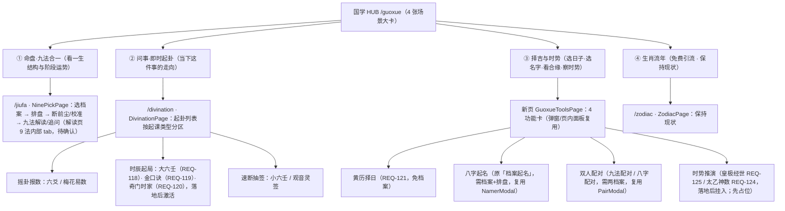

# REQ-126 国学预测导航分层重构 · 国学导航信息架构图（方案稿）

> 状态：🟡 方案待需求方确认（**本稿只产出信息架构方案，不包含任何代码实现**）
> 主责：主开发 Agent ｜ 依据：`docs/需求表.md` REQ-126 / REQ-100 / REQ-094 / REQ-093 / REQ-071 / REQ-080 / REQ-118~125
> 确认后转开发：前端改动落 `frontend/public/index.html`（+ `node frontend/scripts/precompile.js` 门禁），是否新增后端逐法解读端点见「待确认单 §1」。

---

## 0. 定位与口径要点（先对齐，再谈图）

| 项 | 内容 |
|---|---|
| 目标 | 国学 HUB（`/guoxue`）由**方法平铺**改为 **4 张场景大卡**；同步 Banner 下拉导航（REQ-071）与直达路由（REQ-080） |
| 收纳 | REQ-118~125 国学侧全部新增功能（大六壬/金口诀/奇门时家/黄历择日/太乙神数/皇极经世）的**入口挂位**，功能实现各按原 REQ 条目另立开发 |
| 已拍板口径 | ①时势类按方案 A 并入 ③（③ 更名「择吉与时势」）；②删除九法选档案页旧入口；③「档案起名」更名「**八字起名**」 |
| 口径演进 | REQ-100（配对/起名/八字配对同排 3 键上移布局）与 REQ-094（起名命名/入口）的**入口/命名口径被本条覆盖**，旧口径留作历史（REQ-100 中间态已上线，见 §3.3 处置） |
| 范围 | 前端信息架构 + 菜单 + 路由映射；**不涉及**西式占卜 / 心理测试两模块任何页面 |

---

## 1. 现状盘点（grep / 读码定位，`frontend/public/index.html`，行号以 2026-09-09 工作区为准）

### 1.1 国学侧现状组件与入口

| 组件 / 常量 | 行号 | 现状职责 | 登录要求 |
|---|---|---|---|
| `GuoxueHubPage`（`/guoxue`） | L8424-8520 | 国学 HUB：`cards` 三张方法卡 + `quickCards` 同排 3 键（REQ-100 中间态） | **公开页**（不在 `AUTH_REQUIRED_PAGES`） |
| `cards`（三方法卡） | L8434-8452 | ①「九法合一解读」→`nine-pick`；②「生肖流年」→`zodiac`；③「临时起卦」→`divination` | — |
| `quickCards`（REQ-100 中间态） | L8453-8469 | 同一排 3 键：`九法配对`→`openPairAnalyze({module:'guoxue'})`；`八字配对`→`openPairAnalyze({module:'bazi'})`；`档案起名`→`setNamerOpen(true)` | 弹窗内自拉档案 |
| `NinePickPage`（`/jiufa`） | L7867-8142 | 九法合一选档案页：`pickBody` 选档案（L7902-8000）→ `actionCard`（L8002-8077）「开始预测」→`waiting` /「查看/修改结果」→`predict`；`listActions` 新建档案（`returnTo:'nine'`）/ 管理档案（L8078-8099） | 需登录 |
| `nineRunState` | L7813-7865 | 档案九法状态机（未排盘 / 断前尘中 / 已校准 / 已解读），驱动选档案页动作可用性 | — |
| `PredictPage`（解读页，workflow 中间页无 URL） | L5334-5820 | 综合解读：`report.summary` + `report.details` **板块卡流**（L5556-5616）+ 历史追问/矫正（L5617-5635）+ 追问/校准/重跑（L5636+） | 需登录 |
| `TopicPage`（板块独立详情页） | L5826-6010 | `report.details` 单个板块的专属界面 + 板块追问（body 带 `topic=板块名`） | 需登录 |
| `DivinationPage`（`/divination`） | L12042-12720 | 临时起卦：`method-list` 单列罗列 `DIVIN_METHODS`（L12617-12623）→ `openAsk`（L12218）→ 内联操作面板 `asking`（L12629+）→ 全屏独立结果页 `GuaResultScreen` / `SsgwResultScreen`（L12676 / L12696）→ `backToOptions` 回选项列表（L12602） | 需登录 |
| `DIVIN_METHODS`（7 法） | L9529-9564 | `liuyao/meihua/xiaoliuren/sign` 可用；`liuren/jinkoujue/qimen` 置灰（`todo:true`「敬请期待」） | — |
| `ZodiacPage`（`/zodiac`） | L9070-9400+ | 生肖流年：选档案 → 生肖 → 流年推演（确定性零 LLM、免费）；生肖三关系 / 五行关系弹窗 | 需登录 |
| `MOD_NAV_GROUPS`（REQ-071 Banner 下拉） | L7519-7566 | 「国学预测」组 items 3 项：`九法合一`→`nine-pick` / `生肖流年`→`zodiac` / `临时起卦`→`divination`；`TopbarModNav`（L7568-7626）由 `tcSet.banner_dropdown` 控制渲染（L17944），点击走 `goFeature`（L17798-17805） | 点受限项未登录由 BUG-002 拦去登录 |
| 路由表 `REQ080_PAGE_PATH` | L17327-17343 | `'guoxue-hub':'/guoxue'`、`'nine-pick':'/jiufa'`、`'zodiac':'/zodiac'`、`'divination':'/divination'` | — |
| 主题表 `REQ080_PAGE_THEME` | L17371-17412 | 国学系 page 一律 `module:'guoxue', skin:'guoxue'` | — |
| 受限页表 `AUTH_REQUIRED_PAGES` | L1651 | 含 `nine-pick / zodiac / divination` 等；**不含** `guoxue-hub` | — |
| 路由解析 `req080ParsePath` / `req080PathFor` | L17444-17517 / L17433-17440 | pathname ⇄ {page, params} 双向映射；未知路径 `replaceState('/')` 回落地页 | — |
| `pages` 渲染表 | L17806-17917 | page id → 组件实例；`navigate`（L17707-17741）pushState 写真实子路径 | — |
| `LandingPage` | L2432-2528 | 三大模块落地宣传页；`MODS.guoxue.to='guoxue-hub'`，主按钮「进入国学预测」 | 公开 |
| `PairModal` | L2793-2950+ | 配对解析弹窗：`openPairAnalyze({module})` → App `setPairCfg` → 渲染（L17970）；`PAIR_MODULE_META`（L2785-2790）含 `guoxue/bazi/mbti` 三模块 | 需登录 |
| `NamerModal` | L8148-8250+ | 起名弹窗：`POST /api/namer/name`（`case_id+surname+direction`）；无预选档案时弹窗内自拉档案列表 | 需登录 |
| 工作流中间页（无 URL） | L17729-17731 注释 | `onboarding/waiting/calibration/predict/revise/topic/credits` 不写 URL、不新增 history 条目 | — |

### 1.2 现状与 REQ-126 的关键差异（据此定方案边界）

1. **国学 HUB 现状是「方法平铺」**：`GuoxueHubPage` 三方法卡 + 同排 3 键（功能按钮），**不是场景大卡** → 本重构核心动作在 `GuoxueHubPage` 一个组件内完成 cards 重构。
2. **`report.details` 是领域板块聚合、不是逐法**：解读页板块数据由后端 `backend/app/synthesis/synthesizer.py`（`REPORT_TITLES` = 综合趋势/性格/事业/财运/感情/健康/家庭/大势，L8）按 **domain** 聚合输出，**前端没有「9 法逐法解读」的现成契约**。REQ-126 的「9 法内部 tab」需要确认数据源（见 §6 风险 1 / 待确认单 §1）。
3. **起卦列表无分区概念**：`DIVIN_METHODS` 是平铺数组（无 group 字段），7 法一列到底，3 法置灰。
4. **时势类、黄历择日前端零代码**：`grep almanac/taiyi/huangji/择日/黄历` 在 `frontend/public/index.html` 无命中（仅 `DQC_METHODS` 文案含「太乙神数」等，L1941），属全新功能卡。

---

## 2. 国学导航信息架构图（目标态）

### 2.1 总览

### 2.2 四张场景大卡明细

| 大卡 | 副标（方案默认文案） | 内容 | 档案前置条件 | 入口逻辑 |
|---|---|---|---|---|
| ① 命盘·九法合一 | 「看一生结构与阶段运势」 | 选档案 → 排盘（档案管理/建档）→ 断前尘 → 问卷校准 → 九法解读/追问（解读页 9 法内部 tab） | **需 1 档案 + 已排盘**（`nineRunState.go` 才可跑；未排盘引导去管理档案执行排盘） | HUB 卡 → `navigate('nine-pick')`（沿用现状） |
| ② 问事·即时起卦 | 「当下这件事的走向」 | 起卦列表按起课类型 3 分区（见 §2.3）→ 各法操作面板 → 全屏独立结果页 | **免档案**（现状 `case_id: null`） | HUB 卡 → `navigate('divination')`（沿用现状） |
| ③ 择吉与时势 | 「选日子/选名字/看合缘/察时势」 | 黄历择日 / 八字起名 / 双人配对 / 时势推演（见 §2.4） | 黄历：免档案；八字起名：需 1 档案+排盘；双人配对：需 2 档案；时势推演：待定（大概率免档案，随 REQ-124/125 口径） | HUB 卡 → `navigate('guoxue-tools')`（**新页**，见 §5） |
| ④ 生肖流年 | （沿用现有副标文案） | 选档案 → 生肖 → 流年推演（确定性零 LLM 免费）；三关系/五行关系弹窗 | 需 1 档案（出生年推算生肖） | HUB 卡 → `navigate('zodiac')`（沿用现状） |

### 2.3 ② 问事·即时起卦 —— 起卦列表三分区（`DivinationPage` 内 `method-list`）

| 分区标题 | 方法 | 对应 `DIVIN_METHODS.id` | 现状 | 备注 |
|---|---|---|---|---|
| 摇卦报数 | 六爻 / 梅花易数 | `liuyao` / `meihua` | 已上线 | 梅花实为「时间/数字起卦」，归入本区为 REQ-126 已拍板口径，落地时如需改名分区标题见待确认单 §6 |
| 时辰起局 | 大六壬 / 金口诀 / 奇门时家 | `liuren` / `jinkoujue` / `qimen` | **置灰 todo** | REQ-118/119/120 各自落地后解除置灰并保留在本区 |
| 速断抽签 | 小六壬 / 观音灵签 | `xiaoliuren` / `sign` | 已上线 | 小六壬为「三数/掌诀速断」，归本区为 REQ-126 已拍板口径 |

- 交互保持现状链路：点方法 → `openAsk` 内联操作面板（REQ-105 默认不弹输入法）→ `run()` 起卦 → `GuaResultScreen`（六爻/梅花/小六壬）/ `SsgwResultScreen`（观音，REQ-104/081 全屏独立结果页）→「重新起卦 / 回到选项」（`backToOptions` 清盘回**分区后的选项列表**，停留 `/divination`）。
- 仅 `method-list` 渲染结构改成分组；`DIVIN_METHODS` 建议增加 `group: 'yao'|'shi'|'su'` 字段（或新增分区常量表），`todo` 方法在各自分区内保留置灰样式（L12620 `method-cell.todo`）。

### 2.4 ③ 择吉与时势 —— 二级结构（新页）

| 功能卡 | 入口形态（建议） | 前置条件 | 载体 |
|---|---|---|---|
| 黄历择日 | 页内功能卡 → 独立操作/结果面板（或新 tab） | 免档案（REQ-121） | 新前端面板（REQ-121 落地实现） |
| 八字起名 | 页内功能卡 → **复用 `NamerModal`**（更名「八字起名」，`UI_COPY.namer` 文案同步） | 1 档案 + 已排盘 | `NamerModal` 复用，入口自 `GuoxueHubPage.quickCards` 迁入 |
| 双人配对 | 页内功能卡 → **复用 `PairModal`**（`openPairAnalyze({module:'guoxue'|'bazi'})`） | 2 档案（弹窗内选 A/B） | `PairModal` 复用，入口自 `GuoxueHubPage.quickCards` 迁入 |
| 时势推演 | 页内功能卡（先置灰「敬请期待」） | 待 REQ-124/125 口径 | 新功能，REQ-124/125 落地后挂入并激活 |

> ③ 页整体形态二选一（独立页 vs HUB 内二级视图）见 §5 / 待确认单 §2；默认**独立页**以对齐 REQ-080 深链语义。

---

## 3. 入口映射 / 迁移明细（现状 → 新分层）

### 3.1 国学 HUB 四卡与现状入口的映射

| 现状入口（`GuoxueHubPage`） | 行号 | 新分层 | 处置 |
|---|---|---|---|
| `九法合一解读` 卡 | L8434-8439 | ① 命盘·九法合一 | 改名 + 副标「看一生结构与阶段运势」，跳转不变 |
| `临时起卦` 卡 | L8447-8451 | ② 问事·即时起卦 | 改名 + 副标「当下这件事的走向」，跳转不变 |
| `生肖流年` 卡 | L8441-8445 | ④ 生肖流年 | **保持**（免费引流） |
| `九法配对` 键（quickCards） | L8454-8458 | ③ 择吉与时势 · 双人配对 | 迁往 ③ 并**删除同排键** |
| `八字配对` 键（quickCards） | L8459-8463 | ③ 择吉与时势 · 双人配对 | 同上 |
| `档案起名` 键（quickCards） | L8464-8468 | ③ 择吉与时势 · 八字起名 | 同上 + **更名「八字起名」** |
| 黄历择日（无） | — | ③ 择吉与时势 · 黄历择日 | 新增（REQ-121） |
| 时势推演（无） | — | ③ 择吉与时势 · 时势推演 | 占位，REQ-124/125 后挂入 |
| Banner 国学组 3 项 | L7519-7537 | Banner 国学组 4 项 | 同步新分层（§4.1） |

### 3.2 九法选档案页（`NinePickPage`）旧入口处置

- 现状 `NinePickPage` **已无** 配对/起名入口（REQ-100 已移除 `.pair-entry` 与「起名」行，L8428-8431 注释留痕）→ 本重构**无需再删**，只需确认不回流。
- 选档案页的「返回选项」`onNavigate('guoxue-hub')`（L8136）文案与去向不变（仍回国学 HUB）。

### 3.3 REQ-100 中间态（同排 3 键）处置 —— 唯一双入口风险点

- REQ-100 中间态 `quickCards`（L8453-8469）已上线待测试组验收（5843495）。REQ-126 落地时：**③ 卡功能就绪的同一提交内删除 `quickCards` 与 `namerOpen` state（或保留 `namerOpen` 供 ③ 页复用）**，一次性切换，避免「HUB 同排键 + ③ 页内卡」双入口并存导致口径混乱。
- `NamerModal` / `PairModal` 弹窗内部逻辑不动，仅入口位置迁移 + 命名文案更新。

### 3.4 起卦列表分区后「独立结果页 / 回到选项」衔接

- `backToOptions`（L12602-12612）清盘回到 `method-list`（**分区后视图**）；`GuaResultScreen` / `SsgwResultScreen` 的「重新起卦」（`onRedo`，L12685-12693 / L12705+）与「回到选项」（`onBack: backToOptions`）**逻辑零改动**，仅渲染所在列表变为分区结构。
- 分区仅影响列表层；`TIME_METHODS`（L9583）、`DIVIN_API_METHOD`（L9566）、`manualable`（L12088）等按 `method.id` 的既有分发**不受影响**。

---

## 4. Banner 下拉导航（REQ-071）同步映射

### 4.1 `MOD_NAV_GROUPS`「国学预测」组 items：3 项 → 4 项

| 现状（L7522-7536） | 新分层（建议） | page | module/skin |
|---|---|---|---|
| `九法合一` → `nine-pick` | `命盘·九法合一` | `nine-pick` | `guoxue` / `guoxue` |
| `临时起卦` → `divination` | `问事·即时起卦` | `divination` | `guoxue` / `guoxue` |
| `生肖流年` → `zodiac` | `择吉与时势`（**新增**，若走独立页） | `guoxue-tools`（待定） | `guoxue` / `guoxue` |
| — | `生肖流年` | `zodiac` | `guoxue` / `guoxue` |

> 顺序建议按 ①②③④ 排；Banner 条目文案用「大卡名」还是保留功能名见待确认单 §4。
> `TopbarModNav`（L7568）渲染逻辑零改动（`MOD_NAV_GROUPS.map`），仅改数据源；`goFeature`（L17798）不变。

---

## 5. 直达路由建议（`/guoxue` 子路径 vs state 分发）

### 方案 A（**默认推荐**）：真实子路径，沿用 REQ-080 模型

- 新增 ③ 页 page id `guoxue-tools` → 路径 **`/guoxue/tools`**（挂在 `/guoxue` 之下，语义清晰；备选短路径 `/almanac` 见待确认单 §3）。
- 落地需同步 **5 处**（防刷新白屏，BUG-009 教训）：
  1. `REQ080_PAGE_PATH` 增 `'guoxue-tools': '/guoxue/tools'`（L17327-17343）；
  2. `REQ080_PAGE_THEME` 增 `'guoxue-tools': {module:'guoxue', skin:'guoxue'}`（L17371-17412）；
  3. `AUTH_REQUIRED_PAGES` 增 `'guoxue-tools'`（L1651）——③ 页整体需登录（黄历免档案仅指「免选档案」，见待确认单 §7）；
  4. `pages` 渲染表新增 `'guoxue-tools'` → `GuoxueToolsPage`（L17806-17917）；
  5. 新建 `GuoxueToolsPage` 组件（新函数组件，复用 `hub-card / hub-grid` 骨架）。
- `req080ParsePath` 静态段匹配（L17453-17460）自动覆盖新路径（`for pg in REQ080_PAGE_PATH`），**无需改解析函数**。
- 时势推演 / 黄历择日建议作为 ③ 页**页内二级 tab / 功能卡**，不单设 URL（单页可深链、二功能不必各自独立 URL）；如后续需单独分享再拆分。

### 方案 B（不推荐）：`/guoxue` 单 URL + HUB 内 state 分发

- ③ 作为 `GuoxueHubPage` 内部 view 切换（`useState` 二级路由）。缺点：破坏 REQ-080「模块→子路径」映射、Banner 直达与「刷新停留」语义；新增功能无法深链/收藏。仅在需求方明确「国学 HUB 单 URL」时才选。

---

## 6. 开发影响面

### 6.1 本次重构涉及改动（前端，均为 `frontend/public/index.html`，改完跑 precompile）

| 区域 | 位置 | 改动内容 |
|---|---|---|
| 国学 HUB | `GuoxueHubPage` L8424-8520 | `cards` 重构为 4 张场景大卡（新名/新副标）；**删除 `quickCards` 同排 3 键**；③ 卡跳新页；`namerOpen` 视 ③ 页复用情况处置 |
| 新 ③ 页 | 新增 `GuoxueToolsPage` 组件 | 4 功能卡：黄历择日（新面板）+ 八字起名（复用 `NamerModal`）+ 双人配对（复用 `openPairAnalyze`→`PairModal`）+ 时势推演占位 |
| 起卦列表分区 | `DivinationPage` L12617-12623 / `DIVIN_METHODS` L9529-9564 | `DIVIN_METHODS` 增 `group` 字段或新增分区常量；`method-list` 按 3 分区渲染（保留 todo 置灰） |
| Banner 下拉 | `MOD_NAV_GROUPS` L7519-7566 | 国学组 items 3→4 项（文案/新增 ③ 项） |
| 直达路由 | `REQ080_PAGE_PATH` L17327 / `REQ080_PAGE_THEME` L17371 / `AUTH_REQUIRED_PAGES` L1651 / `pages` L17806 | 新增 ③ 页 page id 与路径、主题、登录门禁、渲染实例 |
| 9 法内部 tab（待确认） | `PredictPage` L5334-5820（或新解读视图） | 综合解读 + 9 法 tab（形态/数据源见待确认单 §1，可能含**后端新增逐法聚合端点**） |
| 文案常量 | `UI_COPY.module_hub` L1388-1398 / `UI_COPY.namer` / `UI_COPY.divin` L1454-1468 | 新增/更新 4 卡副标、分区小标题、「八字起名」命名、Banner 文案 |
| 前端门禁 | `node frontend/scripts/precompile.js` | 改 JSX 后必须执行 |

### 6.2 不涉及（明确排除）

- 西式占卜 / 心理测试两模块全部页面（`XishiHubPage` / `MbtiHubPage` / tarot / lenormand / astrology / mbti）——其各自 `openPairAnalyze` 入口（如 L15786 tarot、L16347 mbti）**不在本条范围**，保留。
- `LandingPage` 结构（`MODS.guoxue.to` 仍 `'guoxue-hub'`）与 `NavRail`、`MODULE_HUB`。
- `ZodiacPage` 内部逻辑（④ 保持）。
- `PairModal` / `NamerModal` 弹窗内部功能逻辑（仅入口位置与命名文案）。
- 后端起卦核心链路：`DIVINATION_METHODS` 白名单（`backend/app/api/divination.py` L62）与 Node 起卦服务本轮**不动**，大六壬/金口诀/奇门时家由 REQ-118/119/120 各自放开。
- 档案 / 余额 / 设置（含 `banner_dropdown` 开关逻辑）/ 分享帮填 / Agent 会话。

### 6.3 风险点

1. **9 法内部 tab 数据源缺失（最大风险）**：`report.details` 是领域板块聚合（后端 `synthesizer.REPORT_TITLES`），**前端无逐法解读契约**。「9 法内部 tab」需二选一：后端新增「逐法解读聚合端点」（method-result v2 已落库，可行，属后端改动）或确认降级为「板块 tab」（纯前端）。**须先确认再动工**。
2. **③ 新页路由同步面广**：漏改 `REQ080_PAGE_THEME` / `AUTH_REQUIRED_PAGES` / `pages` 任一 → 深链皮肤错乱 / 未登录直达 / 白屏（BUG-009 教训：静态资源必须根绝对路径 + 路由归一）。
3. **双入口并存**：REQ-100 同排 3 键已上线待验收；③ 卡落地须同提交删除 `quickCards`，否则口径混乱。
4. **置灰法分区展示**：`liuren/jinkoujue/qimen` 在「时辰起局」分区内保留 `todo` 置灰；分区后需确认置灰样式与点击行为（现状 `method-cell.todo`）不回归。
5. **命名一致性**：「档案起名→八字起名」需同步 `UI_COPY.namer`、`NamerModal` 标题、HUB 卡、Banner（如需）、需求表口径。
6. **时势推演占位**：REQ-124/125 未落地前 ③ 页「时势推演」卡显示形态（置灰「敬请期待」vs 隐藏）需定，避免空卡。
7. **precompile 门禁**：所有 JSX 改动后必须跑 `node frontend/scripts/precompile.js`，守护 `<script type="text/babel">` 红线。

---

## 7. 待确认单（带默认建议）

| # | 待确认项 | 默认建议 | 影响 |
|---|---|---|---|
| 1 | **9 法内部 tab 呈现形态与数据源** | 解读页（`PredictPage`）顶部加「综合 + 9 法」tab；数据源由后端新增**逐法解读聚合端点**（method-result v2 已落库，按 method 导出各法解读/结论） | 决定是否新增后端改动；若只许前端 → 降级为板块 tab |
| 2 | **③ 择吉与时势页形态** | **独立页** `GuoxueToolsPage`（复用 hub-card 骨架，内部 4 功能卡：黄历面板 + 弹窗复用 + 占位） | 决定是否新增路由/组件 |
| 3 | **③ 页直达路由** | `/guoxue/tools` 真实子路径（REQ-080 模型，默认）；备选 `/almanac`；不推荐 state 分发 | 决定路由 5 处同步范围 |
| 4 | **Banner 国学组条目文案** | 用 4 大卡名：`命盘·九法合一 / 问事·即时起卦 / 择吉与时势 / 生肖流年`；备选保留功能名并追加「择吉与时势」 | 决定 `MOD_NAV_GROUPS` 文案与顺序 |
| 5 | **时势推演未落地前占位** | ③ 页内显示置灰卡「时势推演 · 敬请期待（皇极经世 / 太乙神数）」 | 决定 ③ 页初始完整性 |
| 6 | **起卦 3 分区小标题文案** | `摇卦报数 / 时辰起局 / 速断抽签`（REQ-126 原文）；落地前复核「梅花归摇卦报数、小六壬归速断抽签」是否符合预期 | 决定 `DIVIN_METHODS` group 归属（方法归类按 REQ-126 已拍板不擅改） |
| 7 | **③ 页登录门禁** | ③ 页**整体需登录**（`AUTH_REQUIRED_PAGES` 增 `guoxue-tools`）；「黄历免档案」仅指已登录下无需选档案 | 决定门禁表改动；若黄历也要免登录引流 → 拆独立公开页 |
| 8 | **新文案归属** | 4 卡副标 / 分区标题 / 「八字起名」命名全部入 `UI_COPY` 常量（`module_hub` / `namer` / `divin`） | 决定文案维护方式（不硬编码） |
| 9 | **③ 页内部二级呈现** | 4 功能用**功能卡 + 弹窗/内联面板**（黄历新面板；起名/配对弹窗复用）；备选：③ 页内 tab 切换（黄历/择吉一个 tab 面板） | 决定 `GuoxueToolsPage` 内部交互结构 |

---

## 8. 附录：本稿引用的现状代码位置（`frontend/public/index.html`）

- 国学 HUB：`GuoxueHubPage` L8424 / `cards` L8434 / `quickCards` L8453 / `NamerModal` 渲染 L8513
- 九法选档案页：`NinePickPage` L7867 / `nineRunState` L7813 / 操作区 L8002 / `listActions` L8078 / 返回 L8134
- 解读页：`PredictPage` L5334 / 板块卡流 L5556 / 追问校准 L5636 / `TopicPage` L5826
- 起卦列表：`DivinationPage` L12042 / `DIVIN_METHODS` L9529 / `method-list` L12617 / `openAsk` L12218 / `backToOptions` L12602 / `GuaResultScreen` L12676 / `SsgwResultScreen` L12696
- 生肖流年：`ZodiacPage` L9070
- Banner 下拉：`MOD_NAV_GROUPS` L7519 / `TopbarModNav` L7568 / 渲染条件 L17944 / `goFeature` L17798
- 路由体系：`REQ080_PAGE_PATH` L17327 / `REQ080_PAGE_THEME` L17371 / `AUTH_REQUIRED_PAGES` L1651 / `req080ParsePath` L17444 / `pages` L17806 / `navigate` L17707
- 弹窗：`PairModal` L2793 / `PAIR_MODULE_META` L2785 / `NamerModal` L8148
- 后端数据源：`backend/app/synthesis/synthesizer.py` `REPORT_TITLES` L8（领域板块聚合）；`backend/app/paipan/slicer.py` L32-44（8 命盘类 + `bazi-hunyin-caiyun` 第 9 法）
